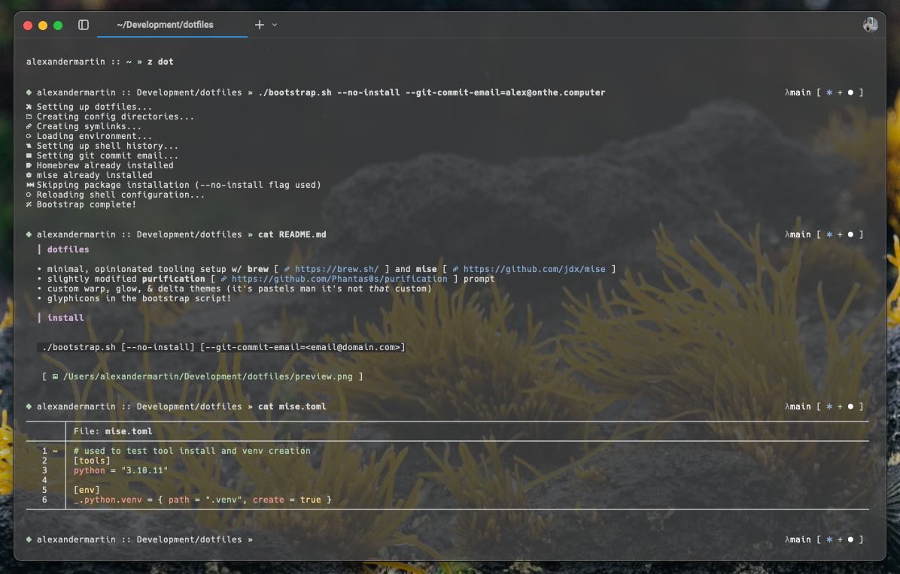

### dotfiles
* minimal, opinionated tooling setup w/ [brew](https://brew.sh/) and [mise](https://github.com/jdx/mise)
* slightly modified [purification](https://github.com/Phantas0s/purification) prompt
* custom warp, glow, & delta themes (it's pastels man it's not _that_ custom)
* glyphicons in the bootstrap script!

### install
```
./bootstrap.sh [--no-install] [--git-commit-email=<email@domain.com>]
```


### status
[](https://github.com/alxmrtn/dotfiles/actions/workflows/shellcheck.yml)
